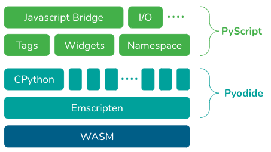

# Frequently asked questions

As the world’s most popular programming language, Python is powerful in its capabilities and comparatively easy to learn, yet the limitations cannot be ignored: it’s hard to install Python and all necessary dependencies; it’s glued to the backend without the ability to make apps or websites; and it’s difficult to share your work.

What if we could remove those limitations, making the power of Python accessible to the masses? The makers of PyScript set out to do just that by enabling Python in the browser for frontend web and application development. No more complicated installs. Projects can be shared with anyone, anywhere—all you need is a browser.

We are fully leaning into the idea that the browser is the most ubiquitous VM by using Python to build a graphical, programmable OS on top to make and share applications. Harness the full power of canvas, webGL, WASI, and even in-browser support for P2P and CRDTs for serverless data sharing and collaboration.

> “This is the exciting beginning for supporting new ways of programming, building, sharing, and deploying applications. Ultimately, we should be spending our time thinking and writing applications to solve the real problems we have, not dealing with mundane, hardware-induced challenges. Let's make programming more fun and simple.” - Fabio Pliger

## Why PyScript?

Exponentially expand accessibility and use cases for Python by enabling Python in the browser for building UIs. Reproduce environments without having to download Python or conda or install other packages. Projects can be shared with anyone and deployed anywhere—all you need is a browser and a web-accessible device (computer, tablet, or mobile).

We are fully leaning into the idea that the browser is the most ubiquitous VM by using Python to build a graphical, programmable operating system on top of the browser to make and share applications. Harness the full power of canvas, webGL, WASI, and even in-browser support for P2P and CRDTs for serverless data sharing and collaboration.

- [PyCon US 2022 Keynote with Peter Wang](https://anaconda.cloud/pyscript-pycon2022-peter-wang-keynote)
- [Example demos from Keynote](https://pyscript.net/examples/index.html)

## What is PyScript?

PyScript is a framework that allows users to create rich Python applications in the browser using HTML's interface and the power of [Pyodide — Version 0.20.0](https://pyodide.org/en/stable/), [WebAssembly](https://webassembly.org/), and modern web technologies. The PyScript framework provides users at every experience level with access to an expressive, easy-to-learn programming language with countless applications.

What is PyScript? Well, here are some of the core components:

- Python in the browser: Enable drop-in content, external file hosting, and application hosting without the reliance on server-side configuration

- Python ecosystem: Run many popular packages of Python and the scientific stack (such as numpy, pandas, scikit-learn, and more)

- Python with JavaScript: Bi-directional communication between Python and Javascript objects and namespaces

- Environment management: Allow users to define what packages and files to include for the page code to run

- Visual application development: Use readily available curated UI components, such as buttons, containers, text boxes, and more

- Flexible framework: A flexible framework that can be leveraged to create and share new pluggable and extensible components directly in Python

All that to say... PyScript is just HTML, only a bit (okay, maybe a lot) more powerful, thanks to the rich and accessible ecosystem of Python libraries.

In short, our mission is to enable programming for the 99%.

## How can a user get started?

Leveraging Python in HTML is literally as simple as adding a few lines of code to your page. The best place to learn more, get started, and stay updated on all things PyScript is [Pyscript.net](http://pyscript.net/). Additional shareable resources below:

- [PyScript Repo](https://github.com/pyscript/pyscript)
- [PyScript Announcement Blog](https://www.anaconda.com/blog/pyscript-python-in-the-browser)
- [PyScript Technical Blog](https://engineering.anaconda.com/2022/04/welcome-pyscript.html)
- [PyScript Nucleus Project](https://anaconda.cloud/s/pyscript)
- [PyScript Documentation](https://docs.pyscript.net/)

## Why isn't this going to be as terrible as PHP?

This comparison is based on both PHP and PyScript having a similar way of declaring things: put a tag on the page and the interpreter handles it. PHP works on the server side and is itself a whole different programming language that has its own directives and semantics.

The choice of using tags to allow people to execute Python is explicit; even if this functionality is similar to PHP, it works differently. First of all, everything runs in the browser itself rather than going to the server side. Secondly, PyScript lives close to the text and allows changes to be made to the visual elements. The PyScript REPL can generate output, plus it provides additional visual elements like buttons, titles, and input boxes. PyScript functions as a framework that generates UIs that makes sense as a tag in the html code.

Currently, both PHP and PyScript operate with only one namespace. However, PyScript will soon support multiple namespaces and different types of isolation of code (scope), along with support for languages beyond Python.

## Why not just learn JavaScript?

JavaScript is not only a different language from python, but a challenging language at that. With PyScript, you now have two languages to choose from, with even more on the roadmap. PyScript allows you to use both libraries and makes JavaScript and Python compatible with one another.

Python is incredibly powerful, super intuitive, and easy to learn. By adding Python to your toolkit, you can use Numpy, SciPy, Pandas, and more, seamlessly. One tradeoff is longer download times, so it isn’t the right tool for everything—but where it is the right tool, it’s almost irreplaceable.

Ultimately, PyScript will enable the use of a variety of languages, offer a standard set of components that is well linked to the REPLs, and allow you to do an introspection on the code base—you can have, for example, a *modifiable* chart as a python object.

## Will PyScript replace JavaScript?

No. PyScript allows Python to leverage HTML, CSS, and JavaScript conventions to build elegant UIs and address general web application building, packaging, distribution, and deployment challenges (a huge pain). We expect the popularity and adoption of HTML, CSS, and JavaScript to rise alongside Python, ultimately making the web a more friendly and hackable place for everyone. That said, we do believe:

- PyScript will displace some use cases that people have to rely on Javascript for now
- PyScript will heavily leverage and interface with existing powerful, feature-full JS libraries, as appropriate
- PyScript will open up web programming to tens of millions of people who would otherwise not have touched JavaScript; so in this way, it will outpace JavaScript

But none of these above scenarios lead to a situation where "PyScript replaces all existing JavaScript." Just as Python itself didn't replace C, C++, or Java. But, it did take a LOT of market share for new use cases where those languages would otherwise have been used.

## What is the difference between PyScript and Pyodide?

PyScript provides HTML tags for embedding and executing Python code in your browser. As a ‘glue’ framework, it sits on top of a variety of tools and provides users access to Pyodide, the WebAssembly port of CPython, which is compiled using Emscripten. In other words, Pyodide enables PyScript users to take advantage of real CPython on the browser.

Together, PyScript and Pyodide allow users to author applications by turning the browser into a code deployment tool that anyone can learn to use.

With respect to the UI, PyScript is opinionated and purposeful, while Pyodide is agnostic, unopinionated, and intended for more general use.

## What packages can I use? Can I use anything from PyPI?

You can use anything within the Pyodide library, and pure python packages from PyPi that do not contain C dependencies should be supported by Pyodide.

There is a list of packages built in Pyodide in [Packages built in Pyodide — Version 0.20.0](https://pyodide.org/en/stable/usage/packages-in-pyodide.html) (these are mostly packages with C extensions). You can also install pure Python packages from PyPI or custom URLs, assuming they have a wheel.

In general, Pyodide doesn’t support all Python features—not because of Pyodide itself, but because some concepts just work differently on the browser (think of sockets/websockets, IO, threading, etc.). If it’s a pure python package that doesn’t have any non-supported features, you should expect it to work. If it has C dependencies, etc., don’t expect it to work unless someone builds/ports them. A lot of the features that don’t work can be made to work, but it will take human power to fix. For example, the PyTorch community wanted those features to work, so they rallied around it to make it happen. Expect the set of libraries that work to grow quickly given the volume of package builds coming from the community.

## This package XXX is not supported because it has C dependencies. How can I make it work?

See [Creating a Pyodide package — Version 0.20.0](https://pyodide.org/en/stable/development/new-packages.html).

## Why is PyScript loading so slowly? Why can’t we put things behind a CDN?

Packages are already served from the JsDelivr CDN. This is not a downloading speed problem—it's WASM assembly time. PyScript loads slowly because the Python standard library and packages are large and WebAssembly code needs to be compiled and run by the browser after they are loaded for the first time.

Currently, there are efforts to mitigate the problem, and Pyodide is currently working on a bundler, for instance.

## Is PyScript owned by Anaconda?

Anaconda doesn’t own PyScript. It is an open source project developed by Anaconda internally, and Anaconda team members are currently the main contributors, but the repo itself is public. We are working on a steering council to ensure the project stays public and owned by the community.

See [Maintainers](../concepts/governance/maintainers.md).

See [Governance Policy](../concepts/governance/policy.md).

## What is the governing model for PyScript?

See [Governance Policy](../concepts/governance/policy.md).

## What is the license?

PyScript uses the Apache-2.0 license.

Pyodide uses MPL-2.0 license. Various packages are distributed under their corresponding license.

## Is Pyodide a replacement for CPython? How does PyScript and Pyodide compare to CPython on WASM?

No. They have different elements that do different things, both of which are additive.

PyScript sits on top of everything. Pyodide came before the work on CPython and WASM. Patches were created in order for it to work, but now that CPython/WASM are progressing, Pyodide is able to remove a few of those patches. Additionally, CPython doesn’t deal with building Python packages for WASM. WASM related work on upstream CPython will integrate into Pyodide in the near future.

For a list of differences from “standard” CPython, see [Pyodide Python compatibility — Version 0.20.0](https://pyodide.org/en/stable/usage/wasm-constraints.html).

## Hasn’t this already been done before by Brython/skulpt?

No. Brython and Skulpt accomplish different things than PyScript and Pyodide.

Brython is client-side and functions as syntax on top of Javascript—it is a reimplementation of Python on top of Javascript, without support for packages or a file system. The extraction of a package in normal Python has been replaced completely by something else. You should be able to run code with minimal changes; however, that isn’t possible with Brython.

Skulpt is a cross compiler from Python to Javascript, leveraged for compatibility with the Python ecosystem. If you want to do any more Python, you would have to send it over.

Fairly similar syntax to normal Python, but not exactly the same. If Brython was an interpreter and a full Python implementation, it could be used with PyScript to leverage packages like Numpy, but that isn’t possible as it stands today. They do have the Python script tag, but it is a smaller API and not as feature rich—which is why PyScript is built on Pyodide, Emscripten, and WebAssembly.

## How can I contribute/help?

**PyScript** - we are currently working on building documentation and a contributing guide. In the meantime, just ask to help on the PyScript [discussions page](https://anaconda.cloud/s/pyscript) or in the [repo](http://github.com/pyscript/pyscript).

**Pyodide** - refer to [Pyodide docs](https://pyodide.org/en/stable/development/contributing.html).

## WebAssembly Security

See [WebAssembly docs](https://webassembly.org/docs/security/).

## Why don’t Requests and Black work?

Requests and Black do not work out of the box because they weren’t meant for the browser. On the browser, sockets multiprocessing works differently, so there is work to be done to actually match things.

For Black, it’s a design choice that can be patched. This is currently being addressed by the team at Pyodide.

Requests do not work because of the sockets issue (sockets and websockets are two different things) and requests are blocking—which you don’t want in the browser. It’ll require putting the runtime on a webworker and utilizing an assistant, but on the main thread it’s unlikely that it’ll work.

There are options as a path forward. For example, Requests can be leveraged using javascript libraries, or building a python async version of Requests API or a python wrapper for fetch (pyfetch), etc. The websockets library has a client side that could be made to work—given that it has all asynchronous APIs, there’s nothing fundamentally difficult about getting it to work.
